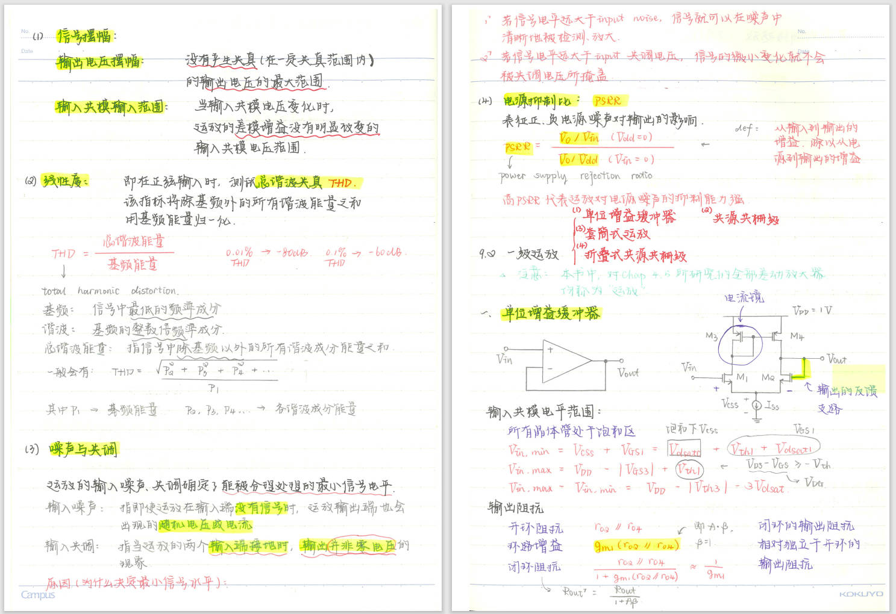
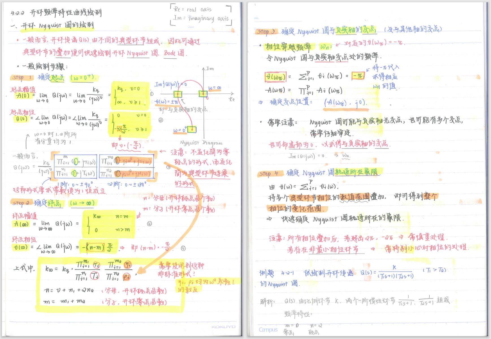
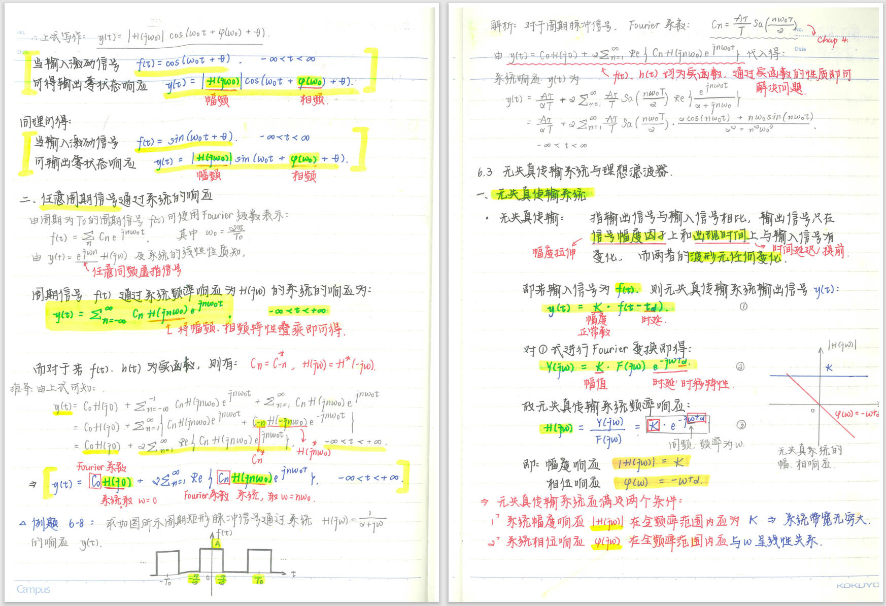

# undergrad_study_notes

### 📚 Introduction of this repository

Welcome to my personal note repository `undergrad_study_notes`. This project grew out of my passion and concern for knowledge sharing and equity in education. As a college student, I understand the importance of acquiring knowledge during the academic journey and the impact it has on personal growth. Therefore, I decided to share some of my theoretical course notes from the School of Automation and School of Integrated Circuits of Guangdong University of Technology, my alma mater, in the hope that they can be helpful to people around the world who are looking for related learning resources.

These notes are my personal accumulation in past course studies. They reflect my learning process, understanding and thinking. Please understand that these notes are not a record of all the courses I have taken, because some of them were recorded directly in textbooks or other materials and cannot be shared in a complete form. But I believe that even these fragmentary records can provide certain guidance and inspiration for those who pursue knowledge.

The content of this repository will be updated occasionally. Due to my studies and other reasons, the update may be slow. But no matter what, my enthusiasm for sharing these materials will not diminish, and I hope that these notes can play some role in your academic journey, even just a little.

### 🎓 Scope of courses

> Please note that these notes are my personal accumulation during the learning process and may not be perfect. Because for some courses my notes were not recorded in the form of notebooks or other materials, but were recorded directly in textbooks or other materials and could not be uploaded and shared.

The following is what has been added so far (08/30/2024):

| Number | Teaching grade | Course name | Source college | Class hours | File format | Level of detail | Recording method |
| ------ | ---------- | ------------------------------- | ------------ | ---- | ------------------- | ----- | ----------|
| 1 | 1st semester of freshman year | Linear Algebra | School of Automation | 32 | pdf | 3.0/4.0 | Handwriting |
| 2 | 1st semester of freshman year | Higher Mathematics (1) | School of Automation | 88 | pdf | 4.0/4.0 | Handwriting |
| 3 | 1st semester of freshman year | Outline of Modern Chinese History | School of Automation | 32 | Microsoft Word | 2.0/4.0 | Keyboard |
| 4 | 1st semester of sophomore year | Analog Electronics | School of Automation | 32 | Microsoft OneNote | 3.5/4.0 | Hybrid |
| 5 | 1st semester of sophomore year | Computer Network Theories | School of Automation | 32 | Microsoft OneNote | 3.5/4.0 | Hybrid |
| 6 | 1st semester of sophomore year | Data Structures and Algorithms | School of Automation | 32 | pdf | 3.0/4.0 | Handwriting
| 7 | 1st semester of sophomore year | College Physics (2) | School of Automation | 64 | iOS/iPadOS Prodrafts | 3.0/4.0 | Handwriting
| 8 | 2nd semester of sophomore year | Digital Electronics | School of Automation | 32 | pdf | 3.0/4.0 | Handwriting |
| 9 | 2nd semester of sophomore year | Signals and Systems | School of Automation | 32 | pdf | 3.5/4.0 | Handwriting |
| 10 | 2nd semester of sophomore year | Principles of Automatic Control | School of Automation | 88 | pdf | 4.0/4.0 | Handwriting
| 11 | 1st semester of junior year | Introduction to Integrated Circuits (theoretical exam part only) | School of Integrated Circuits | 88 | pdf | 1.5/4.0 | Keyboard
| 12 | 1st semester of junior year | Computer Architecture (theoretical exam part only)| School of Integrated Circuits | 64 | XMind, pdf | 2.0/4.0 | Keyboard & Handwriting
| 13 | 1st semester of junior year | Embedded Systems (theoretical exam part only) | School of Integrated Circuits | 64 | pdf | 1.5/4.0 | Keyboard |
| 14 | 1st semester of junior year | Analog Integrated Circuit Design | School of Integrated Circuits | 88 | pdf | 4.0/4.0 | Handwriting |
| 15 | 1st semester of junior year | Digital Integrated Circuit Design | School of Integrated Circuits | 88 | pdf | 4.0/4.0 | Handwriting |
| 16 | 2nd semester of junior year | Switching Power Supply Technology | School of Integrated Circuits | 32 | pdf | 3.5/4.0 | Handwriting |
| 17 | 2nd semester of junior year | Shannon Information Theory Foundation | School of Integrated Circuits | 32 | pdf | 4.0/4.0 | Handwriting |
| 18 | 2nd semester of junior year | Radio Frequency Communication Circuit Foundation | School of Integrated Circuits | 32 | pdf | 3.5/4.0 | Handwriting |
| 19 | 2nd semester of junior year | Communication Principles | School of Integrated Circuits | 64 | pdf | 4.0/4.0 | Handwriting |
> Note: A level of detail of 2.0 and above has certain reference value; a level of detail of 3.0 and above has higher reference value.

> Inner page display 1: "Analog Integrated Circuit Design"

> Inner page display 2: "Principles of Automatic Control"

> Inner page display 3: "Signal and Systems"

### 🔄 Update and maintenance

- Due to busy school work and other reasons, the frequency of updates may be slower.
- Since there are no major-related courses in the fourth year of university (except for corporate internships, graduation projects, and few meaningless courses -- ideological and political courses), the current version (08/30/2024) is the final version.

### ⚠️ Disclaimer and copyright

- The content in this repository is for learning and communication purposes only and may not be used for commercial purposes.
- The copyright of all content belongs to the original author. Please indicate the source when quoting or reprinting.
